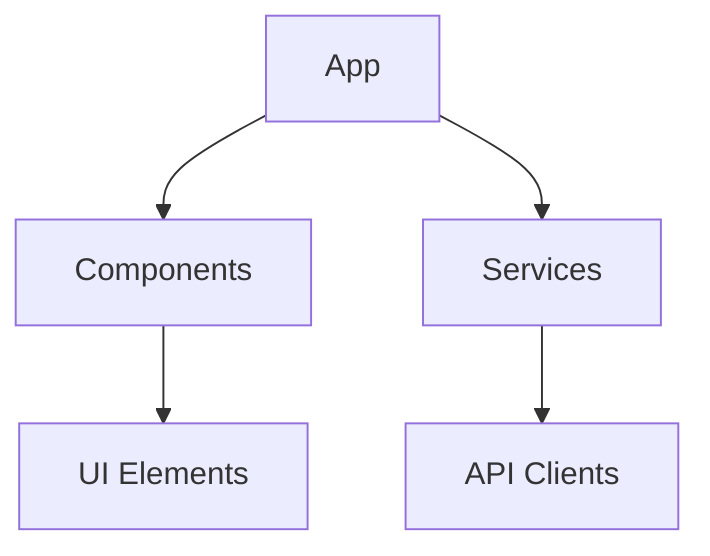

# CLAUDE.md

This file provides guidance to Claude Code (claude.ai/code) when working with code in this repository.

## Commands

### Build and Run

```bash
# Add build commands here

# Add dev commands here
```

### Testing

```bash
# Add test commands here
```


## Project Architecture

fixiplug follows a modular architecture.

### Architectural Insights

- Uses Factory pattern (found in 4 files)
- Uses Observer pattern (found in 18 files)
- Uses Dependency Injection pattern (found in 11 files)


### Core Components

**Main Module** (`src/index.ts`): Entry point


## Domain Terminology

- Fixi
- Quick Start
- Import Options

Fixi
- Creating Plugins

Plugins
- Dispatching Events

Events
- Included Plugins

Fixi


## Historical Context

- Technology migration: feat: add idiomorph swap functionality and enhance content modifier plugin; update demo to showcase new features (2025-05-09)
- Project history dates back to at least 2025-05-03


## Architecture Diagrams

This project has automatically generated architecture visualizations available in the `.agent-assist/visualizations` directory. You can access these diagrams to better understand the project structure.

### Available Diagrams

- **Component Diagram**: Shows relationships between key components
  - View it at: `.agent-assist/visualizations/component-diagram.md`
  - Update it with: `agent-assist visualize component`

- **Module Diagram**: Displays dependencies between modules
  - View it at: `.agent-assist/visualizations/module-diagram.md` 
  - Update it with: `agent-assist visualize module`

- **Class Diagram**: Illustrates inheritance and structure
  - View it at: `.agent-assist/visualizations/class-diagram.md`
  - Update it with: `agent-assist visualize class`

### Sample Visualization



To update these diagrams, run `agent-assist --full` or use specific visualization commands.

## Code Style

- Indentation: 2 spaces
- Quotes: double
- Semicolons: Required


## Repository History

Recent significant commits:
- 9b98fca: feat: add idiomorph swap functionality and enhance content modifier plugin; update demo to showcase new features (2025-05-09)
- 83d7b99: feat: enhance plugin management with new content modifier and error reporting features; update demo and test cases (2025-05-09)
- b591a03: feat: enhance plugin management with improved naming and logging for enable/disable functionality (2025-05-09)
- 3a5ffe4: feat: enhance plugin management with hooks enabling/disabling and testing features (2025-05-09)
- 5cdb8be: feat: implement hooks system and refactor fixiplug core for modular plugin management (2025-05-09)


Main contributors:   50 Wm Talcott

Last major refactor: 2025-05-09: feat: implement hooks system and refactor fixiplug core for modular plugin management


## Environment Setup


### Container Support

No Docker configuration detected.

### Environment Variables

The following environment variables may need to be set:
- PROJECT_BASE_DIR: The base directory of the project
- NODE_ENV: Environment mode (development, production, test)

